# Cross Compiling Yocto Application in Eclipse using Yocto Application Development Toolchain (ADT)

1. Make sure that Yocto based image is deployed on Raspberry Pi.
   
2. Build the SDK in your Yocto project directory using following commands:
* `bitbake meta-toolchain`
* `bitbake -c populate_sdk [image_name]`
  
3. This will create .sh script **tmp/deploy/sdk/[file name].sh** to install toolchain on development PC.
   
4. Download Eclipse Luna with C/C++ from here: [eclipse luna]https://www.eclipse.org/downloads/download.php?file=/technology/epp/downloads/release/2021-06/R/eclipse-cpp-2021-06-R-linux-gtk-x86_64.tar.gz

5. Install Yocto ADT plug-in in Eclipse IDE. Chose "Install New Software" from the "Help" pull-down menu. Install follwoing tools:
* C/C++ Remote Launch (Requires RSE Remote System Explorer)
* Remote System Explorer End-user Runtime
* Remote System Explorer User Actions
* Target Management Terminal (Core SDK)
* TCF Remote System Explorer add-in
* TCF Target Explorer
  
6. Next step is to install the Eclipse Yocto Plug-in into the Eclipse IDE. In Eclipse, select "Install new Software"         from the "Help" menu. Click the "Add..." button to add a repository and enter:
* *Name*: Any name
* *Location*: http://downloads.yoctoproject.org/releases/eclipse-plugin/1.8/luna
Click "Ok" and then chose this new repository on the "Work with" drop-down menu and select the following plug-ins from the list:
* Yocto Project ADT Plug-in
* Yocto Project Bitbake Commander Plug-in
* Yocto Project Documentation plug-in
7. Install Yocto populated SDK into **/opt/** directory.

8. Run Eclipse IDE
   
9. Go to *Windows > Preferences* and open Yocto Project ADT

10. Set fields as shown below:
   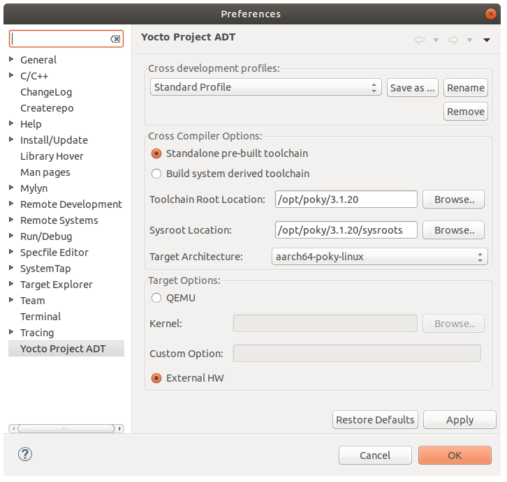

11. Create new C project
   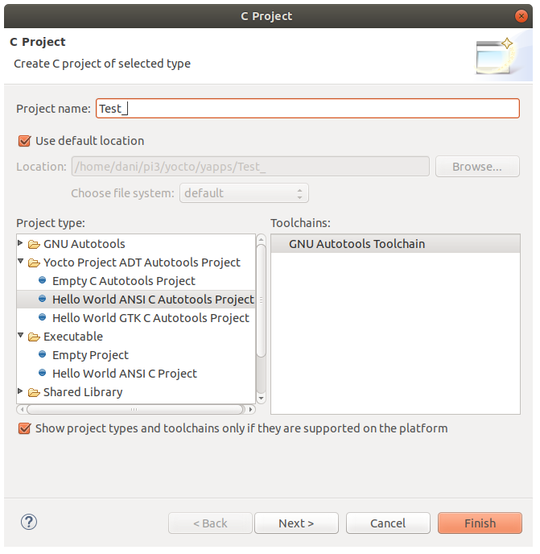
​		Click finish to complete project completion.

12. Go to *Windows > Show View*  and search for **Remote System Explorer**

13. Click on *Remote System Explorer* Tab and Click on *Define a new connection to remote* button. Following pop up windows will be shown:
   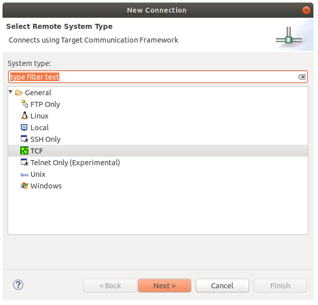	 

14. Select **TCF** and click *next*

15. Set the **Host Name** the IP address of Raspberry Pi and **Connection Name** / **Description** appropriate name of the connection name and description of the connection.
    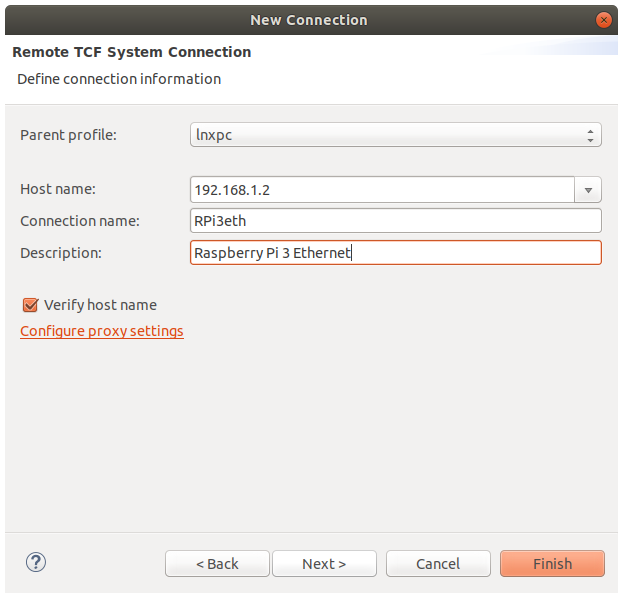

16. Click on *Finish* to close the windows with default menu.

17. Right Click on **RPi3eth** in *Remote System Explorer* pane and click on *connect*

18. Enter **user id**  and **password** same on your remote target i.e. Raspberry Pi in the pop up windows as shown below and click *OK*:
    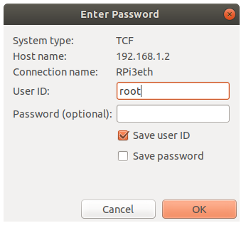

19. If connection is successful then a green arrow will be shown on sub tabs of **RPi3eth** in *Remote System Explorer* pane
    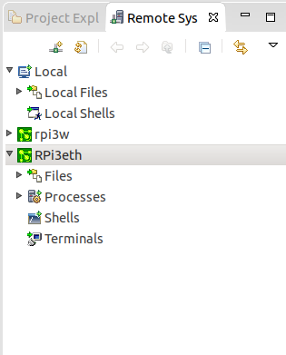

20. Right Click on Terminals and click connect and run some commands this will execute directly on RPi

21. Right click on **Test** in *Project Explorer* pane and select *Test_gdb_aarch64-poky-linux*
   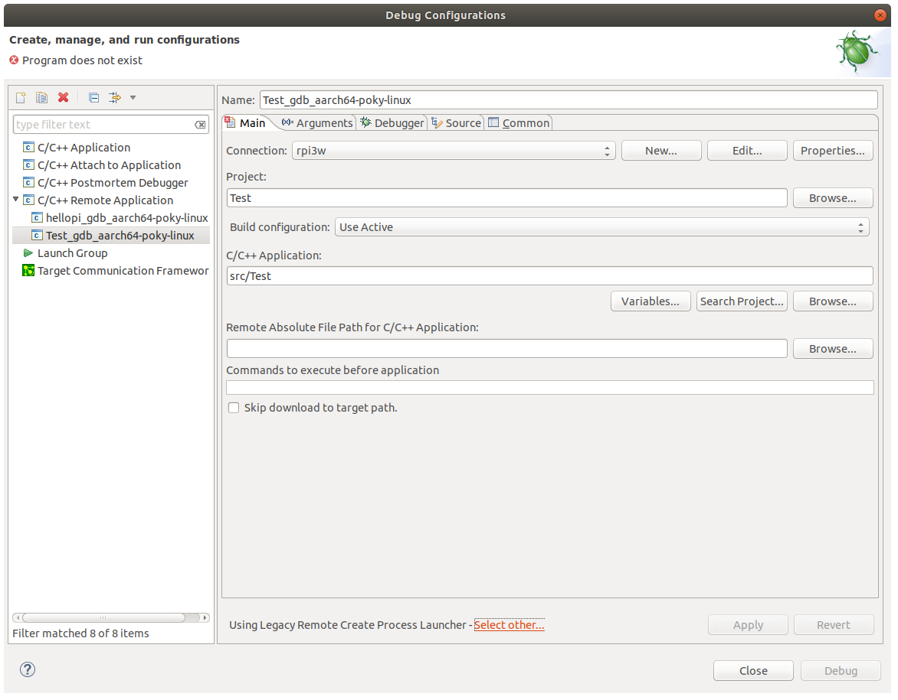

22. Go to *Debugger* Tab and copy *GDB Debugger* field in this case `/opt/poky/3.1.20/sysroots/x86_64-pokysdk-linux/usr/bin/aarch64-poky-linux/aarch64-poky-linux-gdb`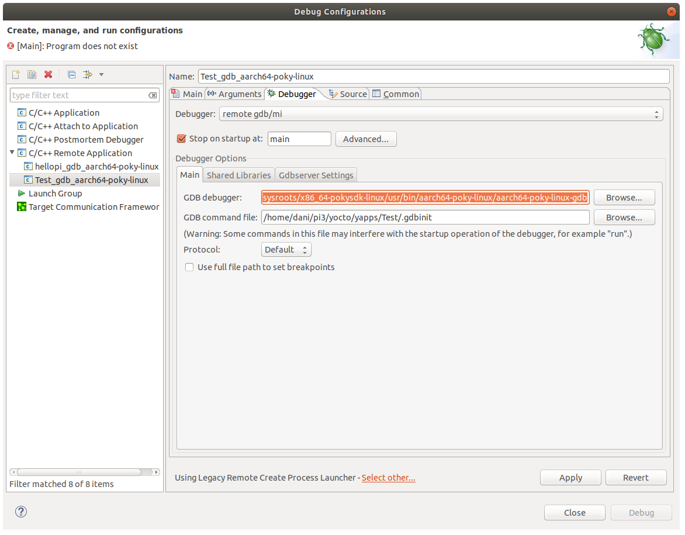

23. Goto *main* tab and Click on *Select other...* and select  as shown below and click ok
   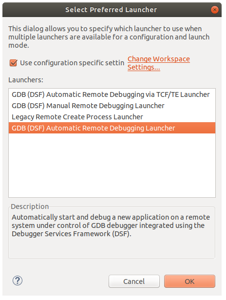

24. Go to *Debugger* Tab again and paste *GDB Debugger* field that was copy earlier in this case `/opt/poky/3.1.20/sysroots/x86_64-pokysdk-linux/usr/bin/aarch64-poky-linux/aarch64-poky-linux-gdb`
   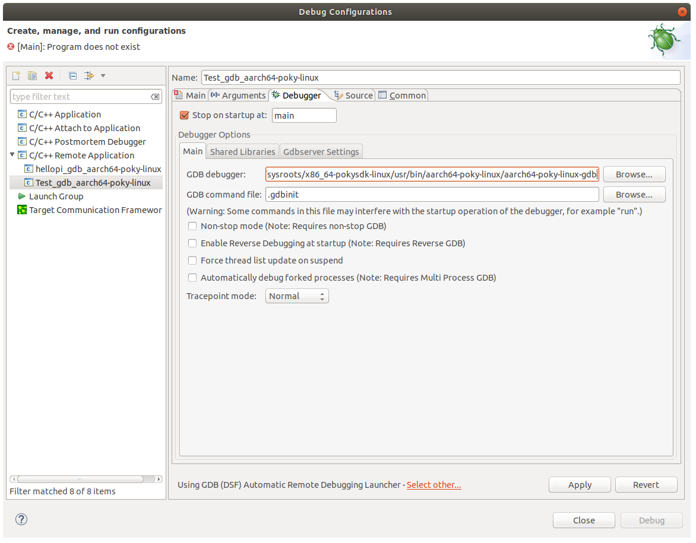

25. Goto *main* tab, select connection as RPI3eth set the target application path with respect to target machine
   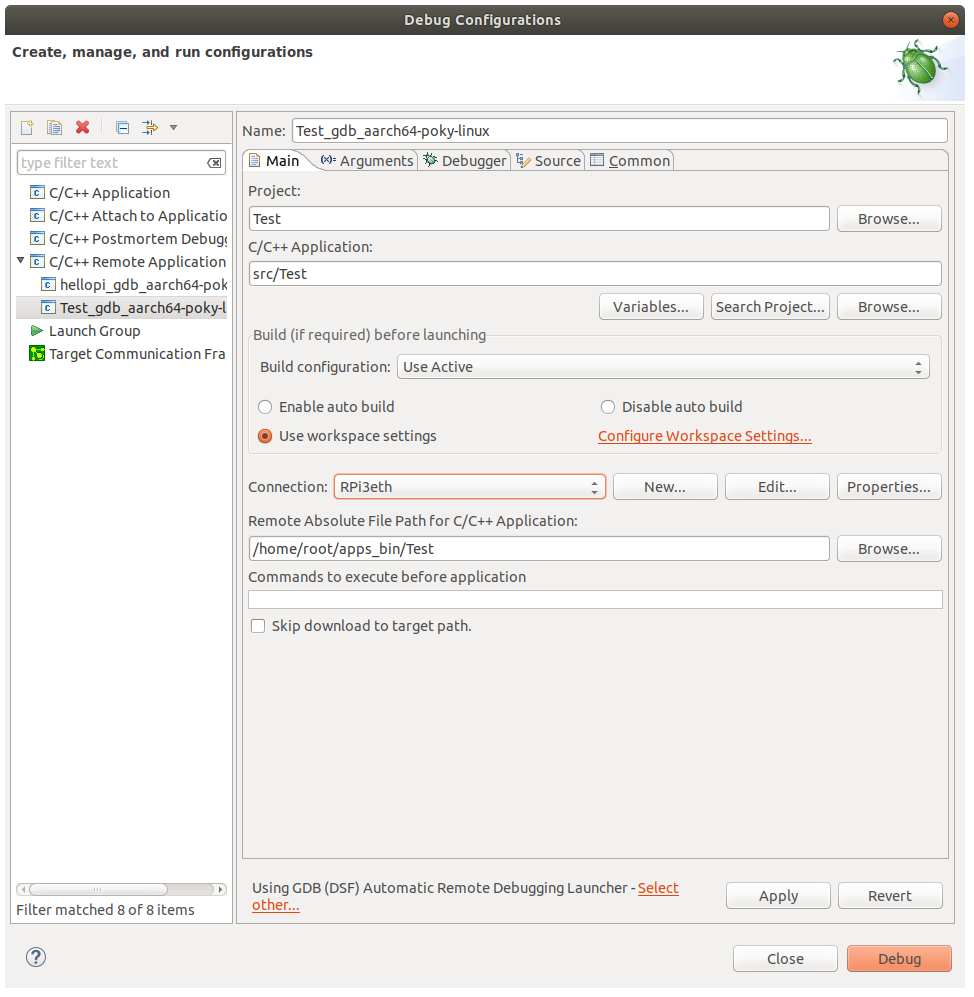

26. Click on **Debug** and click on *step over* button to run instructions

27. click on *stop* button to stop the application
    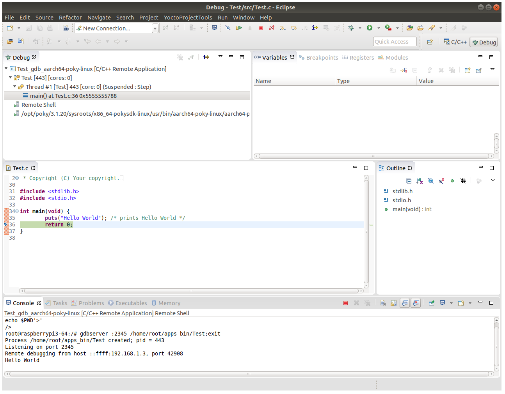

28. click on *C/C++* button to switch to C/C++ development perspective.

29. Optionally you can verify the remote application on target and run manually there.
    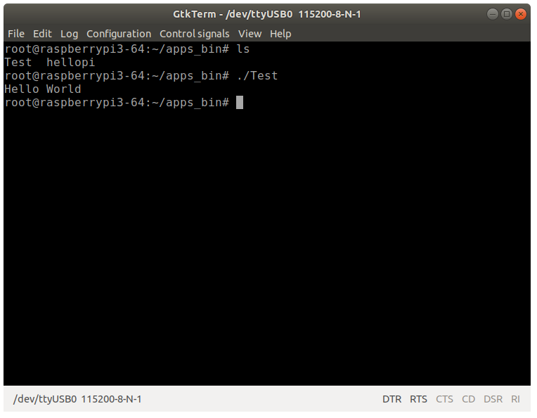

[] Ref.1: https://community.nxp.com/t5/i-MX-Processors-Knowledge-Base/Setting-up-the-Eclipse-IDE-for-Yocto-Application-Development/ta-p/1110480
[] Ref. 2 https://variwiki.com/index.php?title=Yocto_Programming_with_Eclipse_v2
[] Ref. 3 https://variwiki.com/index.php?title=Yocto_Toolchain_installation&release=RELEASE_DUNFELL_V1.5_DART-MX8M-MINI
